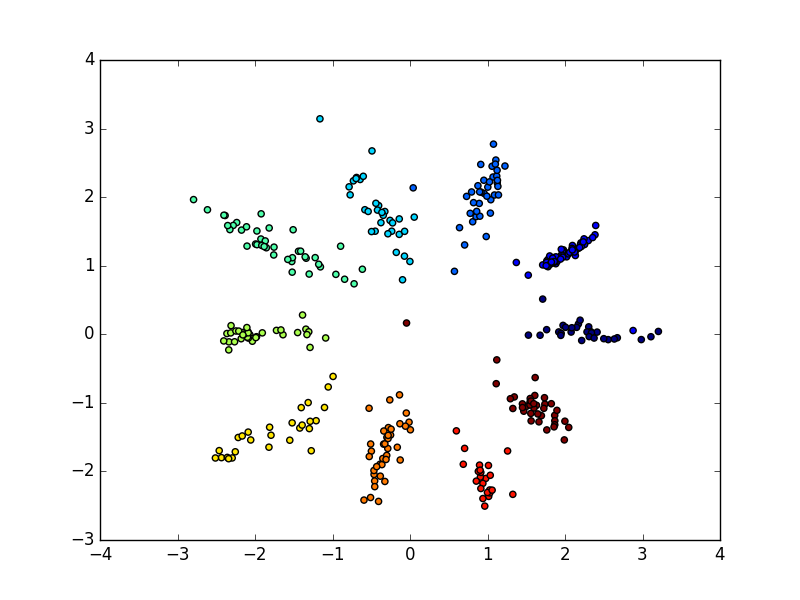

# AAE
Adversarial Auto Encoder (AAE) with tensorflow for MNIST

# usage
- training
```
python main.py -d [MNIST csv file]
```
- making figures after training
```
python using_result.py -d [MNIST csv file]
```

- MNIST csv files can be made by following script.
https://pjreddie.com/projects/mnist-in-csv/

# 100 epoch results


## Random sample from each Gaussian

### 0


### 1


### 2


## walking from (0, 0) to (2, 0)


## walking along with constant radius
